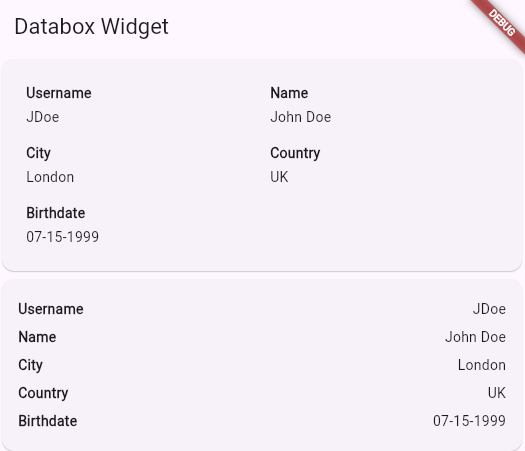

# Simple databox widget

DataboxWidget takes a list of Databox as a parameter.

Databox item is composed of a (String) label and a (String) value.

DataboxWidget has a constructor named .row to display it in row mode.

